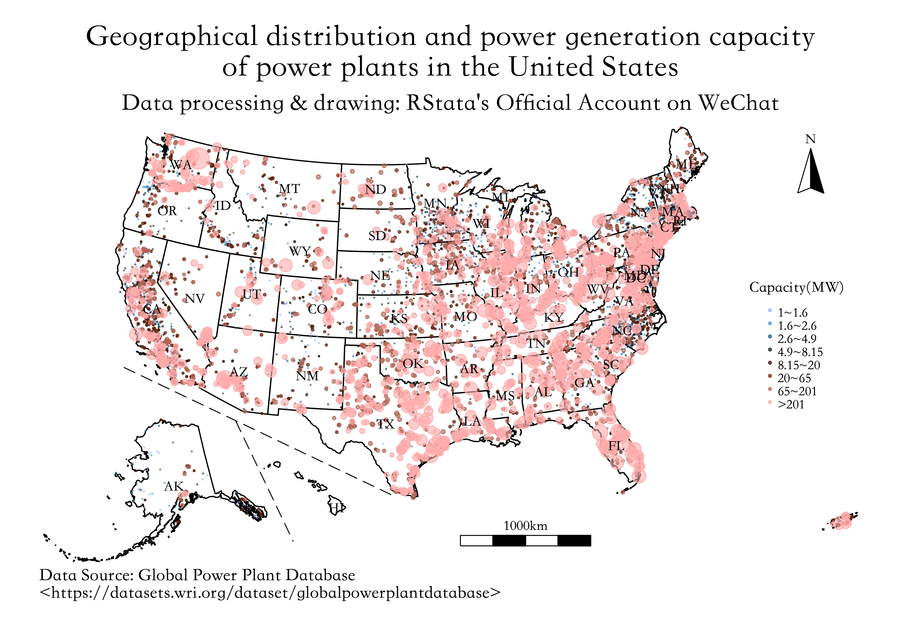
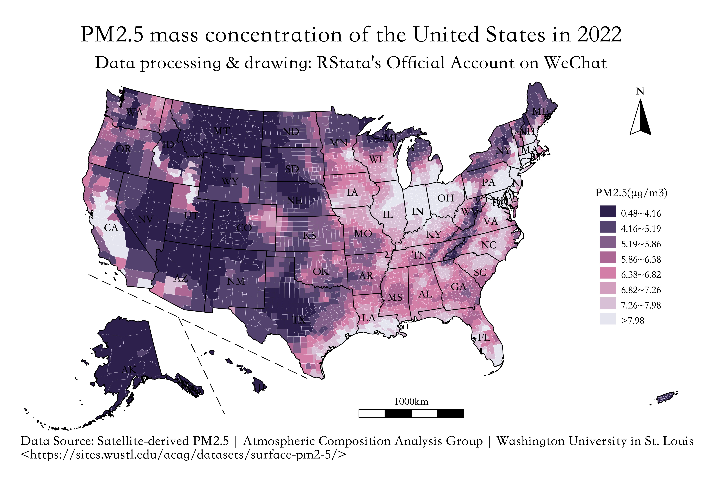

```{r setup, include=FALSE}
knitr::opts_chunk$set(echo = TRUE,
                      dpi = 400,
                      warning = FALSE,
                      message = FALSE,
                      # out.width = "100%",
                      # out.height = "500px",
                      fig.align = 'center',
                      attr.output = ".comment",
                      comment = "#>")
```

> 在学习本课程之前，建议先学习中国市级地图的绘制：https://rstata.duanshu.com/#/brief/course/0e9d78633ae64fefa684d6aad89633bc 记得观看视频讲解～ 

今天给大家分享使用 Stata 绘制美国州县地图的方法，也包含指北针和比例尺。

首先需要准备下面文件/文件夹：

+ laea_projection.ado：用于把经纬度坐标转换成 laea 坐标系下的坐标；
+ mainus_alaska_hawaii：美国的原始地图数据，用于判断散点是美国本土的、阿拉斯加的还是夏威夷的，这样方便后续对阿拉斯加和夏威夷的散点进行坐标变换。
+ us_counties_withns：含指北针和比例尺的美国县级地图数据；
+ us_states_withns：含指北针和比例尺的美国州级地图数据；
+ usmap_labeldf.dta：各州的文本标签坐标数据。

## shp 数据转 dta

为了让大家能更好的理解这份数据的结构，我们还是从 shp 数据出发，演示如何处理得到 Stata 绘图使用的 dta 文件。

这些操作大家后续就不用每次都重复进行了，直接使用处理得到的 dta 文件就好了

### mainus_alaska_hawaii 

mainus_alaska_hawaii 文件夹里面存放的是美国本土、阿拉斯加和夏威夷的分区域矢量数据。使用下面的代码即可以转换得到 dta 文件：

```stata
local name = "mainus_alaska_hawaii"
shp2dta using `name'/`name'.shp, database(`name'_db) coordinates(`name'_coord) replace genid(ID)
```

### us_states_withns 和 us_counties_withns

这两个文件夹中是包含比例尺和指北针数据的美国州县矢量数据（使用 R 语言编辑过）。使用下面的代码即可以转换得到 dta 文件：

```stata
local name = "us_states_withns"
shp2dta using `name'/`name'.shp, database(`name'_db) coordinates(`name'_coord) replace genid(ID)
shp2dta using `name'/`name'_line.shp, database(`name'_line_db) coordinates(`name'_line_coord) replace genid(ID)

local name = "us_counties_withns"
shp2dta using `name'/`name'.shp, database(`name'_db) coordinates(`name'_coord) replace genid(ID)
shp2dta using `name'/`name'_line.shp, database(`name'_line_db) coordinates(`name'_line_coord) replace genid(ID)
```

这样我们就得到了如下文件：

+ us_states_withns_db.dta：各州的属性数据（面数据）；
+ us_states_withns_coord.dta：各州的坐标数据（面数据）；
+ us_states_withns_line_db.dta：各州线条的属性数据；
+ us_states_withns_line_coord.dta：各州线条的坐标数据；

+ us_counties_withns_db.dta：各县的属性数据（面数据）；
+ us_counties_withns_coord.dta：各县的坐标数据（面数据）；
+ us_counties_withns_line_db.dta：各县线条的属性数据；
+ us_counties_withns_line_coord.dta：各县线条的坐标数据；

由于县级地图也可以用州级地图的线条文件，所以这里我们就不处理县级的线条数据了。

指北针和比例尺都包含线条和多边形两个部分，我们希望使用 spmap 的 polygon() 选项绘制，所以需要从面数据里面单独保存指北针和比例尺对应的观测值创建 uspolygon.dta 数据，然后再从面数据里面删除对应的观测值：

```stata
use us_states_withns_db.dta, clear 
keep if inlist(fips, "northarrow", "scale")
*- 可以看到指北针和比例尺的 ID 是 53 和 54 

use us_states_withns_coord.dta, clear 
keep if inlist(_ID, 53, 54)
gen value = 1 
save uspolygon, replace 

use us_states_withns_db.dta, clear 
drop if inlist(fips, "northarrow", "scale")
save us_states_withns_db.dta, replace 
```

线条数据里面大致包含了三类线条，州界、指北针和比例尺的线条以及分隔线，我们在坐标文件里生成 group 来区分：

```stata
use us_states_withns_line_db.dta, clear 
*- 这里我们把线条分为三类，一类是州界，一类是比例尺和指北针，最后一类是分隔线
use us_states_withns_line_coord.dta, clear 
gen group = 1
replace group = 2 if inlist(_ID, 53, 54, 55, 56)
replace group = 3 if inlist(_ID, 57)
save us_states_withns_line_coord.dta, replace 
```

这样在绘图的时候我们就可以给不同的线条设置不同的粗细、颜色和线型了。

区县地图也可以使用州级地图的线条和 uspolygon.dta，所以就不必额外处理了：

```stata
use us_counties_withns_db.dta, clear 
drop if inlist(fips, "northarrow", "scale")
save us_counties_withns_db.dta, replace  
```

## 散点坐标变换

由于地图数据是经过特别设计的，所以普通的经纬度不能直接绘制在该地图上，需要进行一些坐标变换。

下面以全球发电厂数据库为例进行演示。

首先筛选美国的发电厂，可以根据经纬度判断哪些发电厂在美国境内：

```stata
import delimited using "global_power_plant_database_v_1_3/global_power_plant_database.csv", clear 
*- 判断哪些点属于 mainus/alaska/hawaii
geoinpoly latitude longitude using mainus_alaska_hawaii_coord.dta 
drop if mi(_ID)
ren _ID ID 
merge m:1 ID using mainus_alaska_hawaii_db.dta
*- 边界的点可能会判断错误，删除不属于美国的发电厂
drop if country != "USA"
keep gppd_idnr capacity_mw class latitude longitude
save points, replace 
```

提供的美国地图的坐标系是 "+proj=laea +lat_0=45 +lon_0=-100 +x_0=0 +y_0=0 +a=6370997 +b=6370997 +units=m +no_defs"，把经纬度转换成这个坐标系下的坐标：

```stata
use points.dta, clear 
laea_projection longitude latitude x y
save points2, replace 
```

由于设计地图的时候对阿拉斯加和夏威夷进行了调整，所以这里需要按照当初调整的规则对散点坐标进行相同的调整：

```stata
*- 对阿拉斯加的散点进行特定的坐标变换
use points2.dta, clear 
keep if class == "alaska"
mkmat x y, mat(xymat)
mat rotate_mat = (0.6427876, 0.7660444 \ -0.7660444, 0.6427876)
mat newmat = xymat * rotate_mat 
svmat newmat
drop x y 
ren (newmat1 newmat2) (x y)
replace x = x/2 + 300000
replace y = y/2 - 2000000
save alaska_points, replace 

*- 对夏威夷的也进行变换
use points2.dta, clear 
keep if class == "hawaii"
mkmat x y, mat(xymat)
mat rotate_mat = (0.8191520, 0.5735764 \ -0.5735764, 0.8191520)
mat newmat = xymat * rotate_mat 
svmat newmat
drop x y 
ren (newmat1 newmat2) (x y)
replace x = x/2 + 3600000
replace y = y/2 + 1800000
save hawaii_points, replace 
```

然后合并三部分散点即可：

```stata
use points2.dta, clear 
keep if class == "mainus"
append using alaska_points 
append using hawaii_points 
egen group = cut(capacity_mw), group(8) label
tab group 
save points_all, replace
```

## 绘制地图 + 散点图

下面就可以绘图了：

```stata
use us_states_withns_db.dta, clear 
spmap using us_states_withns_coord, id(ID) ///
	line(data(us_states_withns_line_coord.dta) ///
		by(group) size(vvvthin vthin vthin) ///
		pattern(solid solid dash)) ///
	point(data(points_all) x(x) y(y) by(group) ///
		fcolor("158 176 255%60" "71 153 201%60" "34 87 113%60" ///
			"15 28 36%60" "44 14 0%60" "104 36 15%60" ///
			"179 101 86%60" "255 172 172%60") ///
		proportional(capacity_mw) size(*0.3 ...) ///
		legenda(on)) ///
	polygon(data(uspolygon) fc(black ...)) ///
	label(data(usmap_labeldf) x(X) y(Y) label(abbr) size(*0.8)) ///
	legend(order(7 "1~1.6" 8 "1.6~2.6" 9 "2.6~4.9" ///
				10 "4.9~8.15" 11 "8.15~20" 12 "20~65" ///
				13 "65~201" 14 ">201") ///
			ti("Capacity(MW)", size(*0.5)) ///
			pos(3) col(1) ring(0)) ///
	ti("Geographical distribution and power generation capacity" "of power plants in the United States") ///
	subti("Data processing & drawing: RStata's Official Account on WeChat") ///
	caption("Data Source: Global Power Plant Database" "<https://datasets.wri.org/dataset/globalpowerplantdatabase>", size(*0.8)) ///
	xsize(20) ysize(14) graphr(margin(medium))

gr export pic1.png, width(4800) replace 
```



## 绘制填充地图

填充地图的绘制就很简单了。下面以 `2022年美国各县平均PM2.5浓度.dta` 为例：

```stata
use us_counties_withns_db.dta, clear 
merge 1:1 fips using "2022年美国各县平均PM2.5浓度.dta"
drop _m 
egen group = cut(PM25), group(8) label 
tab group 

*- 区县地图也建议使用 us_states_withns_line_coord.dta 线条
spmap group using us_counties_withns_coord, id(ID) ///
	clmethod(unique) osize(vvvthin ...) ocolor(white ...) /// 
	fc("45 32 76" "84 66 110" "130 94 138" "173 103 149" "210 126 167" "210 159 191" "216 192 214" "229 229 240") /// 
	line(data(us_states_withns_line_coord.dta) ///
		by(group) size(vthin vthin vthin) ///
		pattern(solid solid dash)) ///
	polygon(data(uspolygon) fc(black ...)) ///
	label(data(usmap_labeldf) x(X) y(Y) label(abbr) size(*0.8)) ///
	legend(order(2 "0.48~4.16" 3 "4.16~5.19" 4 "5.19~5.86" ///
				5 "5.86~6.38" 6 "6.38~6.82" 7 "6.82~7.26" ///
				8 "7.26~7.98" 9 ">7.98") ///
			ti("PM2.5(µg/m3)", size(*0.5)) ///
			pos(3) col(1) ring(0)) ///
	ti("PM2.5 mass concentration of the United States in 2022") ///
	subti("Data processing & drawing: RStata's Official Account on WeChat") ///
	caption("Data Source: Satellite-derived PM2.5 | Atmospheric Composition Analysis Group | Washington University in St. Louis" "<https://sites.wustl.edu/acag/datasets/surface-pm2-5/>", size(*0.8)) ///
	xsize(20) ysize(14) graphr(margin(medium))

gr export pic2.png, width(4800) replace 
```


